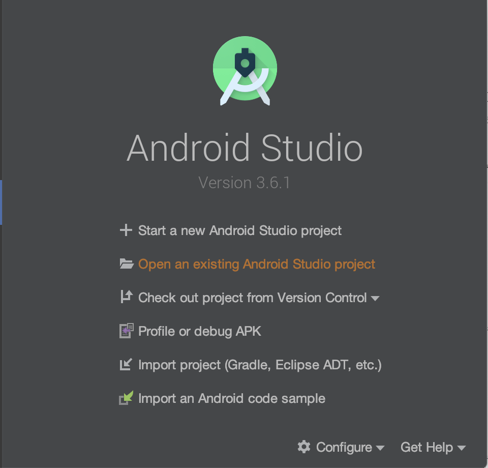
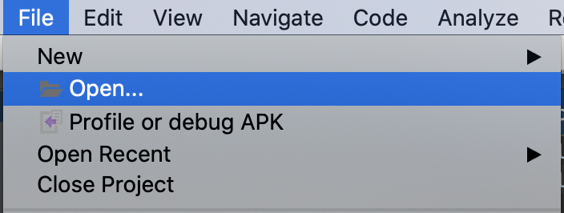
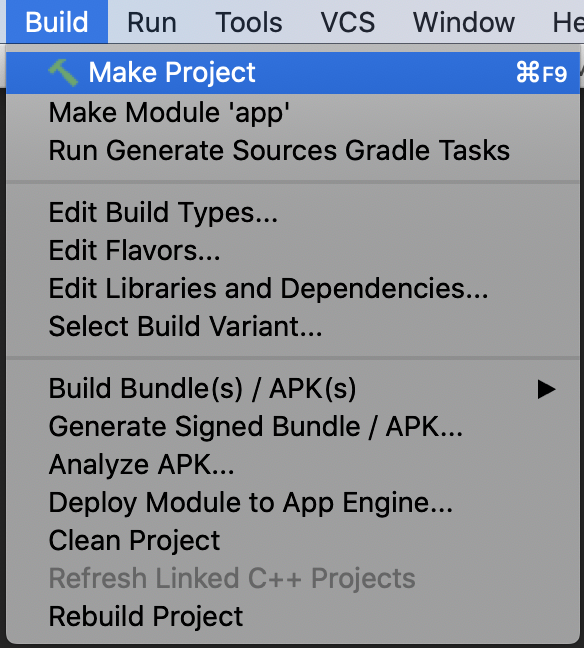

# MyFit

MyFit is a mobile application that acquires data from the user during the day.

The app is divided into two versions: the **fit version** and the **robot version**.
The main purpose of the *fit version* is to gather information from wristband (steps done, distances travelled, calories burned, heart rates), instead, the main purpose of the *robot version* is to control remotely the PyBot.
Leaving aside the differences in the main purpose, the other functionalities of the app are shared for both the versions and they are:

- Collect foods eaten
- Collect workouts done
- Provide statistics about the last fitness data
- Monitor a family member

## Installation

In this section are described all the steps required to install and deploy the MyFit app.

### Step 1 - Software Requirements

- Install Android studio.

### Step 2 - Initialisation

- Open Android Studio
- If it is the first access choose **Open an existing Android Studio project**.



- Otherwise go in the menu bar and select **File** > **Open**.



- Navigate till the code directory and press **Open**
- Go in the menu bar and select **Build** > **Make Project**, in order to download all the dependency located in the grandle file.



### Step 3 - Configuration

- In the project tab change the perspective to **Android**
- Navigate to **app** > **res** > **values** > **strings.xml**

```xml
<string name="url_server"></string>
<string name="app_preferences">FIT</string>
```

- Change the **url\_server** with your server IP address
- Change the **app\_preferences** with your preferences, value allowed are:
  - FIT
  - PYBOT

### Step 4 - Deployment

- On your smartphone go in **Settings** and press 7 times on the build model until the developer mode is activated
- Go in the developer mode section and enable **Debug** and **Install through USB**
- Connect your smartphone to the PC
- Go in the menu bar and select **Run** > **Run app**
